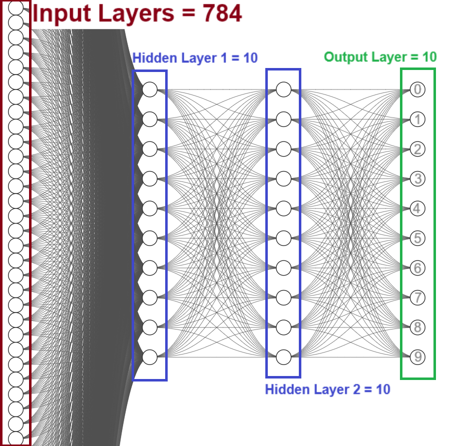

# rede_neural_classificatoria_mnist
Construindo uma rede neural do zero para classificar números escritos a mão.  

Para ter um melhor entendimento de como funciona, vamos construir uma rede neural do zero para classificar números escritos a mão.  
Não vamos utilizar bibliotecas de redes neurais ou qualquer inteligência artificial, vamos construir tudo utilizando apenas bibliotecas de álgebra linear e cálculo.  
Para treino e teste do modelo, será utilizado o [MNIST](https://en.wikipedia.org/wiki/MNIST_database), que é um dataset de imagens de números escritos a mão bastante conhecido.  
O dataset possui 70.000 imagens. Cada imagem possui tamanho 28x28 pixels.  
  

  
Como cada imagem possui tamanho 28x28 pixels, podemos representar cada imagem como um vetor de tamanho 784 (28x28).  
Sendo assim, o input da nossa rede neural será um vetor de tamanho 784.  
Como queremos classificar os números de 0 a 9, o output da nossa rede neural será um vetor de tamanho 10.  
  
Vamos construir duas camadas com 10 neurônios cada para processar o input e gerar o output.  
  
Deve ficar parecido com isso:  

